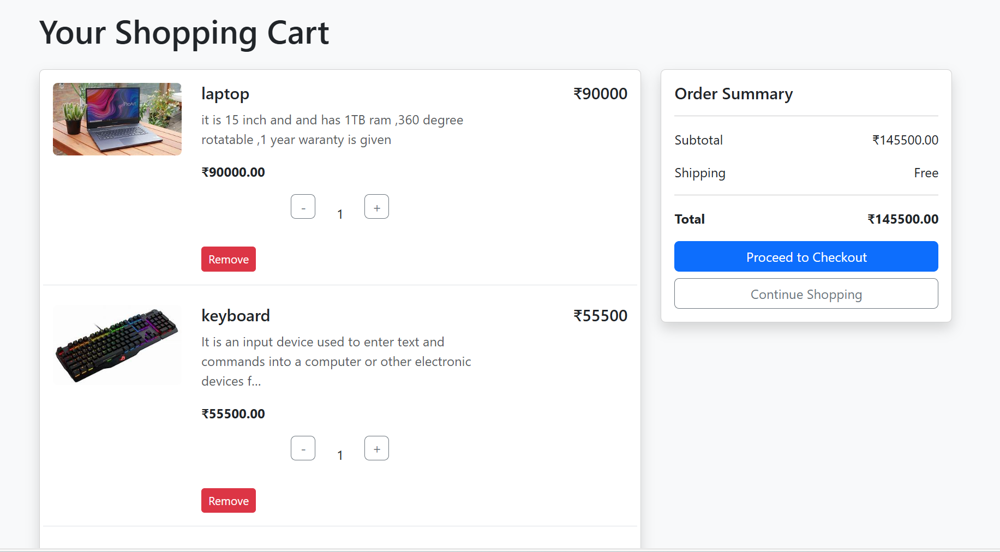

🛒 Django Shopping Cart

📌 Overview

This project implements a shopping cart system using Django, designed to handle item selection, quantity management, and order processing. It provides a backend-focused approach, making it suitable for integration into larger applications that require cart functionality.

Features:

✅ Add and remove items from the cart  
✅ Display cart total dynamically  
✅ User authentication for personalized carts
✅ You can also increase and decrease quantity

🚀 Technologies Used

- **Backend**: Django, Python, SQLite3
- **Frontend**: HTML, CSS
- **Styling**: Bootstrap

## 🛠 Installation & Setup

### Prerequisites

Ensure you have Python installed. Install Django using:

```sh
pip install django
```

### Clone the Repository

```sh
git clone https://github.com/yourusername/django-shopping-cart.git
cd django-shopping-cart
```

### Configure Database & Migrations

```sh
python manage.py migrate
```

### Create a Superuser (Optional for Admin Panel)

```sh
python manage.py createsuperuser
```

### Run the Development Server

```sh
python manage.py runserver
```

Access the project at **`http://127.0.0.1:8000/`**.

## 📌 Configuration (settings.py)

The project uses **SQLite** as the default database. You can change this in `settings.py`:

```python
DATABASES = {
    'default': {
        'ENGINE': 'django.db.backends.sqlite3',
        'NAME': BASE_DIR / 'db.sqlite3',
    }
}
```

### Static & Media Files

```python
STATIC_URL = '/static/'
STATICFILES_DIRS = [os.path.join(BASE_DIR, 'static')]
MEDIA_URL = '/media/'
MEDIA_ROOT = BASE_DIR / 'media'
```

## 🎯 Usage Guide

1️⃣ Browse available products  

2️⃣ Add items to the cart  

3️⃣ Remove items

## 🤝 Contribution

Want to improve this project? Contributions are welcome! Fork the repo, create a branch, and submit a pull request.

## 📜 License

This project is licensed under the **MIT License**.

---
